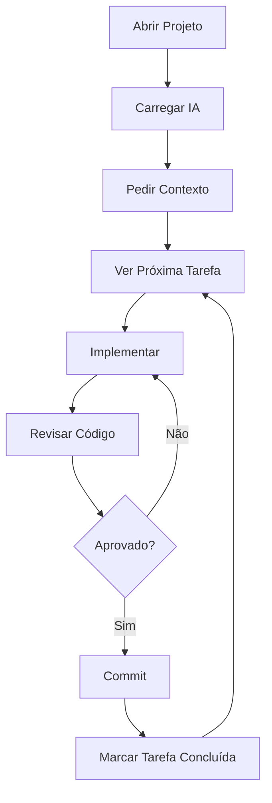

# Tutorial 02: Executar Tudo com IA

Aprenda a usar uma IA para desenvolver seu projeto.

---

## O Que Você Vai Aprender

- Configurar sua IA preferida
- Prompts eficientes para desenvolvimento
- Fluxo de trabalho com Zoryon Tasks + IA

---

## IAs Compatíveis

| IA | Tipo | Melhor Para |
|----|------|-------------|
| Claude Code | CLI | Desenvolvimento completo |
| Cursor | IDE | Edição de código |
| Kiro | IDE | Desenvolvimento visual |
| Trae | IDE | Refatoração |
| ChatGPT | Chat | Dúvidas e planejamento |
| Gemini | Chat | Pesquisa e código |

---

## Opção 1: Claude Code (Recomendado)

### Instalação

```bash
npm install -g @anthropic-ai/claude-code
```

### Uso

```bash
cd meu-projeto
claude
```

### Prompt Inicial

Cole este prompt na primeira interação:

```
Você é meu assistente de desenvolvimento. Este projeto usa o Zoryon Genesis.

Por favor:
1. Leia o arquivo .zoryon/docs/COMECE-AQUI.md
2. Execute `pnpm task next` para ver a próxima tarefa
3. Me guie na implementação

Responda sempre em português.
```

### Fluxo de Trabalho

1. **Claude lê o projeto** e entende a estrutura
2. **Você pede** a próxima tarefa
3. **Claude implementa** e explica
4. **Você revisa** e aprova
5. **Claude faz commit** das mudanças

---

## Opção 2: Cursor

### Configuração

O arquivo `.cursorrules` é carregado automaticamente quando você abre o projeto no Cursor.

### Uso

1. Abra o projeto no Cursor
2. Pressione `Cmd+L` (Mac) ou `Ctrl+L` (Windows/Linux)
3. Digite seu prompt

### Prompt Inicial

```
@.zoryon/docs/COMECE-AQUI.md

Me ajude a desenvolver este projeto.
Comece mostrando as tarefas pendentes com `pnpm task list`.
```

### Dica: Mencionar Arquivos

Use `@` para referenciar arquivos:
- `@src/app/page.tsx` - arquivo específico
- `@.zoryon/docs/` - pasta inteira

---

## Opção 3: Kiro

### Configuração

O arquivo `kiro.config.json` em `.zoryon/agents/kiro/` contém as configurações.

### Uso

1. Abra o projeto no Kiro
2. Carregue a configuração do Zoryon
3. Use os comandos visuais

---

## Opção 4: ChatGPT / Gemini / Outros

### Passo 1: Copiar Contexto

Copie o conteúdo destes arquivos:
- `.zoryon/docs/COMECE-AQUI.md`
- `.zoryon/tasks/tasks.json`

### Passo 2: Colar no Chat

```
Estes são os arquivos do meu projeto Zoryon Genesis.
Me ajude a implementar a próxima tarefa pendente.

[Cole o conteúdo dos arquivos aqui]
```

### Passo 3: Copiar Código

Copie o código gerado pela IA e cole no seu projeto.

---

## Prompts Úteis

### Ver Tarefas

```
Execute `pnpm task list` e me mostre as tarefas
```

### Próxima Tarefa

```
Qual a próxima tarefa? Me ajude a implementar
```

### Concluir Tarefa

```
Terminamos a tarefa 1. Execute `pnpm task done 1`
```

### Criar Componente

```
Crie um componente de [descrição] usando Tailwind CSS.
Deve ser responsivo e acessível.
```

### Resolver Erro

```
Estou com este erro:

[Cole o erro aqui]

Me ajude a resolver.
```

### Explicar Código

```
Explique o que este código faz:

[Cole o código aqui]
```

### Refatorar

```
Refatore este código para ser mais legível:

[Cole o código aqui]
```

### Adicionar Feature

```
Adicione a funcionalidade de [descrição].
Considere:
- TypeScript estrito
- Tratamento de erros
- Testes se necessário
```

---

## Boas Práticas

### 1. Sempre Dê Contexto

❌ Ruim:
```
Faça um botão
```

✅ Bom:
```
Crie um componente Button em src/components/ui/button.tsx
Deve ter variantes: primary, secondary, destructive
Use Tailwind CSS e TypeScript
```

### 2. Revise o Código

Sempre leia o código antes de aceitar:
- Faz o que você pediu?
- Está bem escrito?
- Tem erros de segurança?

### 3. Faça Commits Frequentes

```
A cada feature completa, faça commit:
git add .
git commit -m "feat: adicionar botão com variantes"
```

### 4. Use as Tarefas

```
Antes de começar, execute:
pnpm task next

Depois de terminar:
pnpm task done <id>
```

### 5. Peça Explicações

Não entendeu algo? Pergunte!

```
Por que você usou useCallback aqui?
Explique essa lógica de forma simples.
```

---

## Fluxo Completo



---

## Próximos Passos

| Tutorial | Descrição |
|----------|-----------|
| [Deploy na Vercel](./03-deploy-vercel.md) | Publique seu projeto |
| [Auth com Clerk](./04-auth-clerk.md) | Adicione autenticação |

---

*Zoryon Genesis - O começo de tudo*
